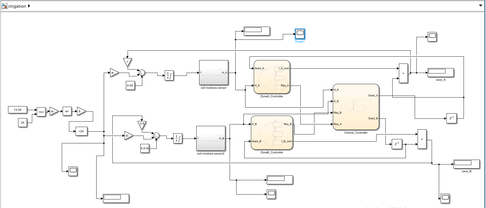

# Smart Irrigation Control System (Simulink)

## 🚀 Overview
This project implements a smart irrigation system using MATLAB/Simulink and a Stateflow-based controller.  
The objective is to automatically manage irrigation cycles based on sensor inputs, environmental conditions, and system states.

## 🧠 Key Features
- Intelligent irrigation scheduling
- Multi-zone control logic
- Automatic pump management
- Maintenance & fault handling logic
- Simulation with configurable parameters
- Stateflow control architecture

## 🛠️ Technologies Used
- MATLAB
- Simulink
- Stateflow

---

## 🖼️ Simulation Model
Below is a preview of the Simulink model:

---

## 📦 Files Included
- `irrigation.slx`
- Model screenshot

---

## 👤 Author
**Mondher Khadhraoui**  
Embedded Systems Engineer
