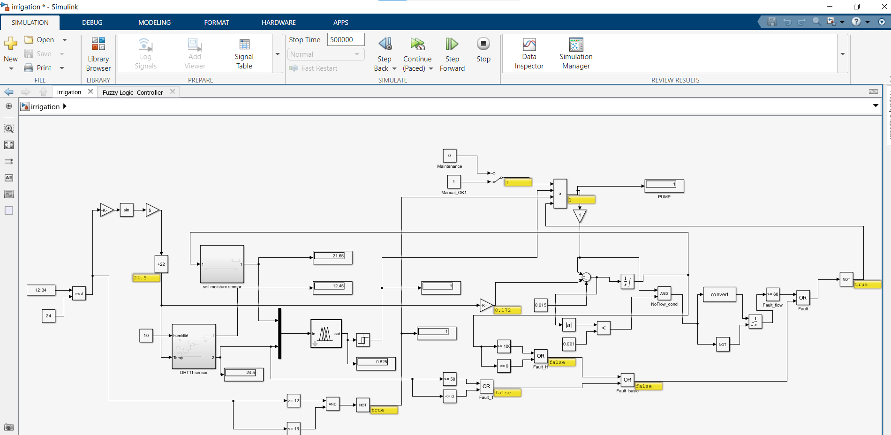
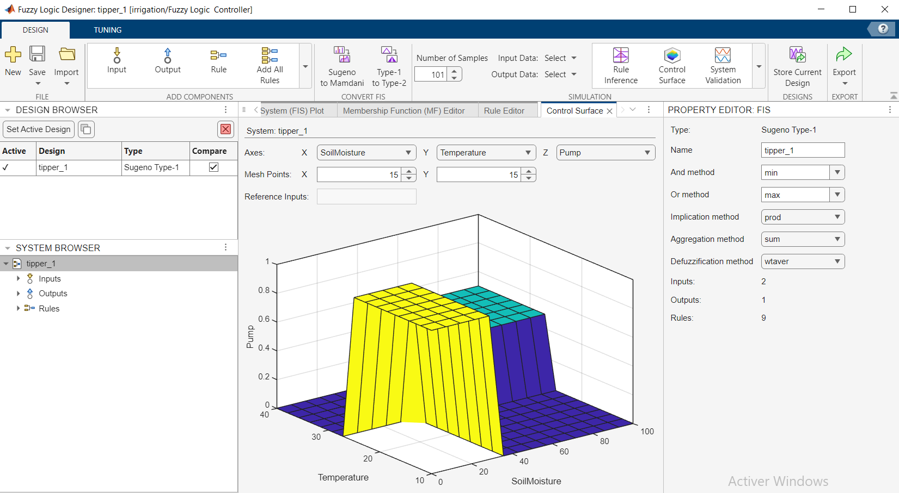

# Smart Irrigation Control System (Simulink)

## 🚀 Overview
This project simulates an intelligent irrigation control system using MATLAB/Simulink.  
The system adjusts watering cycles automatically based on multiple conditions and scheduling logic.

## 🧠 Features
- Dynamic irrigation scheduling
- Multi-zone simulation
- Automatic water control logic
- Parameter customization
- Visual block-based design

## 🛠️ Technologies & Tools
- MATLAB
- Simulink

## 🖼️ Simulation Model
Below is a preview of the Simulink model:

## 📈 System Diagram

## 📊 Results

## 📦 Files Included
- `irrigation.slx`
- Screenshots
- Project documentation elements

## 👤 Author
Mondher Khadhraoui  
Embedded Systems Engineer

